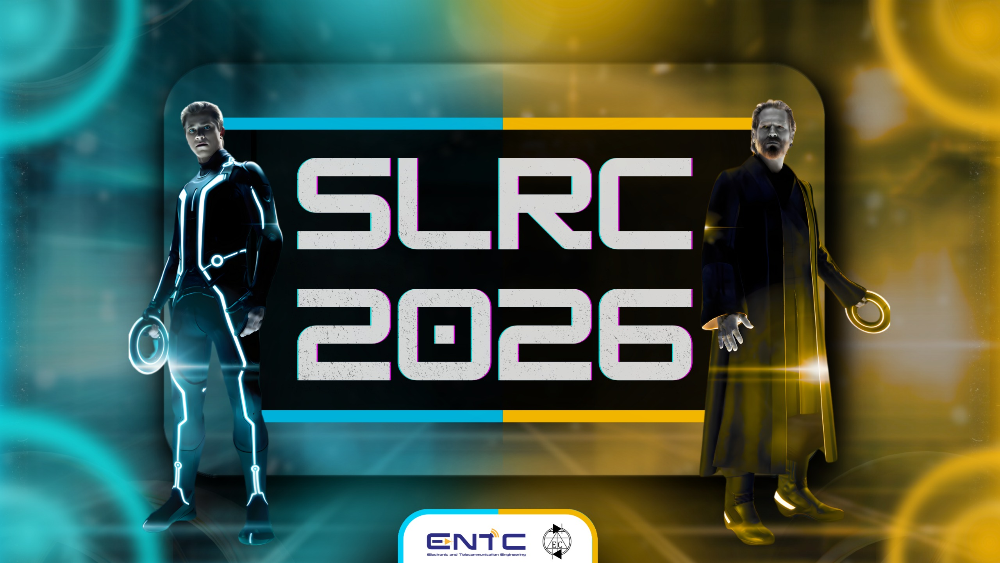

# Sri Lankan Robotics Challenge (SLRC) 2026-Task
---

Welcome to the official task repository for the Sri Lankan Robotics Challenge (SLRC) 2026, organized by E-Club, University of Moratuwa. SLRC is Sri Lanka’s premier robotics competition, bringing together school and university students to showcase their robotics skills in a competitive and innovative environment.

This repository contains the official task descriptions, guidelines, and resources for participants competing in SLRC 2026.

## Competition Categories
---
<ul type="•">
  <li>School category🏫 </li>

  Designed for school students under 20 years old, focusing on fundamental robotics concepts.

  <li>University category 🎓 </li>

  Open to undergraduates under 28 years old, featuring advanced robotics challenges.
  
</ul>

## How to Participate ? 
---

### 📢 Registrations deadline on February 15th 2026!
<ul type="•">
  <li> Visit our official website to register: <a href = "https://ent.uom.lk/slrc/"> SLRC Registration Page </li>     
  <li> For updates, join our <b>WhatsApp Community</b>: <a href ="https://www.whatsapp.com/channel/0029Vb60iUl47XeHJwGN5Z2m">Join Here </li>

</ul>

## Documents & Resources
---

### 📃 Technical Specification Guidelines:

- School Category
    - 📄 Task Document : [School Category Doc](docs/SLRC-2026-School-Category-Task.pdf)
    - 🤖 3D Arena : [School 3D Arena](https://bit.ly/SLRC-Sch-Arena)

- University Category
    - 📄 Task Document : [University Category](docs/SLRC-2026-University-Category-Task.pdf)
    - 🤖 3D Arena : [University 3D Arena](https://bit.ly/SLRC-Uni-Arena)
    - 🔃 Simulation documents and guidelines repo : To be released soon.

## Demo Videos
---

### SLRC 2026 | School Category Task Description

To be released soon.

### SLRC 2026 | University Category Task Description

To be released soon.

## Stay connected
---

Stay updated with the latest announcements and competition details through our official channels:

📌 SLRC Website: [ent.uom.lk/slrc](ent.uom.lk/slrc)

📌 WhatsApp Community: [Join Here](https://www.whatsapp.com/channel/0029Vb60iUl47XeHJwGN5Z2m)

📌 SLRC Facebook Page: [UOM SLRC](https://www.facebook.com/share/1Bjn23iqy7/)

📌 SLRC YouTube Channel: [Sri Lankan Robotics Challenge](https://youtube.com/@srilankanroboticschallenge2341?si=uRBchqYlCUkpAJmF)

📌 Contact Email: [slrc@uom.lk](mailto:slrc@uom.lk)

📌 LinkedIn: [Electronic Club UOM](https://www.linkedin.com/company/electronic-club-uom/)

Follow us for updates, important announcements, and competition-related discussions! 🚀

